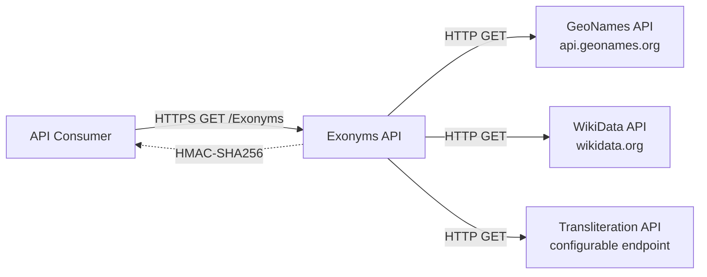
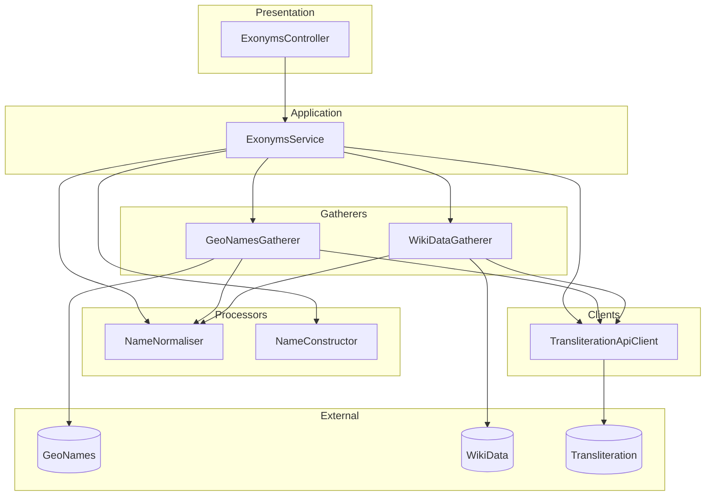
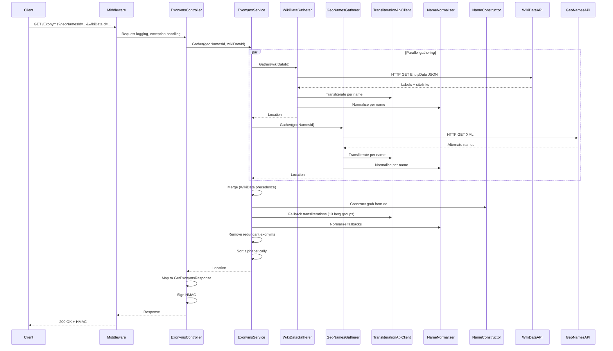
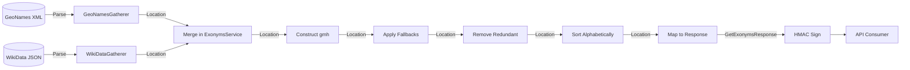

# Exonyms API Architecture

This document describes the current architecture of the Exonyms API, a REST service that aggregates exonyms (alternative names for places in different languages) from GeoNames and WikiData, applies transliteration, normalisation, historical construction, and fallbacks.

## 📑 Table of Contents

- [Purpose](#-purpose)
- [System Context](#-system-context)
- [Architectural Style](#-architectural-style)
- [Runtime Flow](#-runtime-flow)
- [Components](#-components)
- [Architectural Areas](#-architectural-areas)
- [Data Architecture](#-data-architecture)
- [Interfaces and Integrations](#-interfaces-and-integrations)

## 🎯 Purpose

The Exonyms API provides a single endpoint (`GET /Exonyms`) that returns exonyms for a geographic location identified by GeoNames ID and/or WikiData ID. The system aggregates data from multiple external sources, processes names through a pipeline of transformations (transliteration, normalisation, construction, fallbacks), and returns a signed JSON response.

**Intended audience**: Developers maintaining the API, API consumers, and operators deploying the service.

**Value**: Documents the system boundaries, data flows, and design decisions to enable safe evolution and onboarding.

## 🌐 System Context

The principal external boundaries are:
- **API Consumers**: Inbound HTTPS requests with query parameters (`geoNamesId`, `wikiDataId`); outbound signed JSON responses.
- **GeoNames API**: Outbound HTTP GET to `api.geonames.org/get` with `geonameId` and rotating username; returns XML with alternate names.
- **WikiData API**: Outbound HTTP GET to `wikidata.org/wiki/Special:EntityData/{id}.json`; returns JSON with labels and sitelinks.
- **Transliteration API**: Outbound HTTP GET via NuciAPI envelope; returns transliterated text for 68 supported languages.
- **Configuration/Secrets**: HMAC signing key, transliteration API base URL, GeoNames usernames (currently hardcoded).

## 🏗️ Architectural Style

**Clean Architecture with layered dependency inversion**. The codebase separates concerns into distinct layers with dependencies pointing inward toward domain logic. External systems are accessed through interfaces implemented in the infrastructure layer.

The principal architecture boundaries are:
- **Presentation**: HTTP endpoint, request validation, response signing (`ExonymsController`, DTOs).
- **Application Services**: Orchestration, business rules, merging, fallbacks (`ExonymsService`).
- **Gatherers**: External data retrieval, parsing, normalisation (`IGeoNamesGatherer`, `IWikiDataGatherer`).
- **Processors**: Name transformation, construction, normalisation (`INameNormaliser`, `INameConstructor`).
- **External Clients**: Third-party API communication (`ITransliterationApiClient`).
- **Infrastructure**: DI composition, middleware, configuration (`ServiceCollectionExtensions`, `Startup`, `Program`).

## 🔄 Runtime Flow

The principal runtime sequence is:
1. **Request received**: Kestrel → middleware pipeline (logging, exception handling, HTTPS, routing).
2. **Controller action**: `ExonymsController.Get` binds query parameters, calls `ExonymsService.Gather`.
3. **Parallel gathering**: WikiData and GeoNames gatherers fetch and process names concurrently (each calls transliteration and normalisation per name).
4. **Merge**: WikiData names take precedence; GeoNames fills gaps.
5. **Construction**: German Middle High German (`gmh`) constructed from German (`de`).
6. **Fallbacks**: 13 language groups synthesised from Russian (`ru`).
7. **Deduplication**: Names matching `defaultName` removed.
8. **Sorting**: Results sorted by language code.
9. **Response**: Mapped to DTO, HMAC-signed, returned.

## 🧩 Components

| Component | Responsibility | Principal Dependencies | Lifetime |
|-----------|----------------|------------------------|----------|
| `ExonymsController` | HTTP endpoint, request binding, response signing | `IExonymsService`, `SecuritySettings` | Transient (per request) |
| `ExonymsService` | Core orchestration: gather, merge, construct, fallback, deduplicate, sort | `IGeoNamesGatherer`, `IWikiDataGatherer`, `INameConstructor`, `INameNormaliser`, `ITransliterationApiClient` | Singleton |
| `GeoNamesGatherer` | Fetch/parse GeoNames XML, process alternate names | `INameNormaliser`, `ITransliterationApiClient`, `HttpClient` | Singleton |
| `WikiDataGatherer` | Fetch/parse WikiData JSON, process labels and sitelinks | `INameNormaliser`, `ITransliterationApiClient`, `HttpClient` | Singleton |
| `NameNormaliser` | Regex-based removal of administrative suffixes/prefixes in 50+ languages | None (stateless) | Singleton |
| `NameConstructor` | German Middle High German construction from German via 70+ rules | None (stateless) | Singleton |
| `TransliterationApiClient` | Call external transliteration API via NuciAPI envelope | `INuciApiClient` | Transient |
| `NuciApiClient` | HTTP client with NuciAPI envelope handling, retry policies | `HttpClient`, `TransliterationSettings` | Transient |

## 🗂️ Architectural Areas

### Presentation Layer

Paths:
- `ExonymsAPI/API/Controllers/ExonymsController.cs`
- `ExonymsAPI/API/Requests/GetExonymsRequest.cs`
- `ExonymsAPI/API/Responses/GetExonymsResponse.cs`

Responsibilities:
- HTTP endpoint exposure (`GET /Exonyms`)
- Query parameter binding and validation
- Response mapping and HMAC signing
- Delegation to application service

Boundary rules:
- No business logic; thin controller
- Uses `NuciApiController.ProcessRequest` for standardised handling
- Authorisation: `NuciApiAuthorisation.None` (public endpoint)

### Application Services

Paths:
- `ExonymsAPI/Service/ExonymsService.cs`
- `ExonymsAPI/Service/IExonymsService.cs`

Responsibilities:
- Orchestrate dual-source gathering
- Merge with WikiData precedence
- Construct historical names (`gmh` from `de`)
- Apply language fallbacks (13 groups → `ru`)
- Remove redundant exonyms (matching `defaultName`)
- Sort results alphabetically

Boundary rules:
- Pure orchestration; no HTTP calls directly
- All external access via injected interfaces
- Stateless per request (creates new `Location` objects)

### Gatherers

Paths:
- `ExonymsAPI/Service/Gatherers/GeoNamesGatherer.cs`
- `ExonymsAPI/Service/Gatherers/IGeoNamesGatherer.cs`
- `ExonymsAPI/Service/Gatherers/WikiDataGatherer.cs`
- `ExonymsAPI/Service/Gatherers/IWikiDataGatherer.cs`

Responsibilities:
- HTTP communication with external APIs
- Response parsing (XML for GeoNames, JSON for WikiData)
- Language code extraction and filtering
- Per-name transliteration and normalisation

Boundary rules:
- Each creates own `HttpClient` (should use `IHttpClientFactory`)
- GeoNames: rotates 60+ hardcoded usernames
- WikiData: extracts language codes from sitelinks via regex
- Both delegate transliteration/normalisation to injected services

### Processors

Paths:
- `ExonymsAPI/Service/Processors/NameNormaliser.cs`
- `ExonymsAPI/Service/Processors/INameNormaliser.cs`
- `ExonymsAPI/Service/Processors/NameConstructor.cs`
- `ExonymsAPI/Service/Processors/INameConstructor.cs`

Responsibilities:
- `NameNormaliser`: 100s of regex patterns removing administrative suffixes/prefixes across 50+ languages and 15+ categories
- `NameConstructor`: 70+ transformation rules for German Middle High German (`gmh`) from German (`de`)

Boundary rules:
- Stateless, thread-safe, pure functions
- No external dependencies
- Extensive regex pattern libraries

### External Clients

Paths:
- `ExonymsAPI/Client/TransliterationAPI/TransliterationApiClient.cs`
- `ExonymsAPI/Client/TransliterationAPI/ITransliterationApiClient.cs`
- `ExonymsAPI/Client/TransliterationAPI/Requests/GetTransliterationsRequest.cs`
- `ExonymsAPI/Client/TransliterationAPI/Responses/GetTransliterationsResponse.cs`
- `ExonymsAPI/Client/Configuration/TransliterationSettings.cs`

Responsibilities:
- Wrap external transliteration API via `NuciApiClient`
- Support 68 languages (hardcoded list)
- Graceful degradation on failure (return original text)

Boundary rules:
- Uses `NuciApiClient` for envelope handling
- Transient lifetime (new per request)
- No caching

### Infrastructure

Paths:
- `ExonymsAPI/Program.cs`
- `ExonymsAPI/Startup.cs`
- `ExonymsAPI/ServiceCollectionExtensions.cs`
- `ExonymsAPI/Logging/MyOperation.cs`
- `ExonymsAPI/Logging/MyLogInfoKey.cs`
- `ExonymsAPI/Client/Configuration/SecuritySettings.cs`

Responsibilities:
- Generic host bootstrap
- Middleware pipeline (NuciAPI logging, exception handling, HTTPS, routing)
- DI composition (singletons for services, transient for clients)
- Configuration binding
- Structured logging with custom operations and log info keys

Boundary rules:
- `ServiceCollectionExtensions` centralises all DI registrations
- Settings bound as singletons from `IConfiguration`
- NuciAPI middleware handles cross-cutting concerns

## 💾 Data Architecture

| Data or Store | Owner | Representation and Storage | Lifecycle or Consistency |
|---------------|-------|----------------------------|--------------------------|
| `Location` | `ExonymsService` | In-memory object graph (`DefaultName` + `Dictionary<string, Name>`) | Created per request; no persistence |
| `Name` | `ExonymsService` | In-memory object (`OriginalValue`, `Value`, `Comment`) | Created per request; no persistence |
| GeoNames XML | `GeoNamesGatherer` | Streamed HTTP response → `XDocument` | Per request; not cached |
| WikiData JSON | `WikiDataGatherer` | Streamed HTTP response → `JObject` | Per request; not cached |
| Transliteration cache | None | N/A | No caching implemented |
| HMAC key | `SecuritySettings` | Configuration (env var / appsettings) | Loaded at startup; rotated manually |

## 🔌 Interfaces and Integrations

| Interface or Integration | Direction | Contract | Owner | Failure Semantics |
|--------------------------|-----------|----------|-------|-------------------|
| `GET /Exonyms` | Inbound | Query: `geoNamesId?`, `wikiDataId?` → JSON response with HMAC | `ExonymsController` | 400 if both missing; 500 on upstream failure |
| GeoNames API | Outbound | `GET /get?geonameId={id}&username={user}` → XML | `GeoNamesGatherer` | Exception → 500; username rotation on failure |
| WikiData API | Outbound | `GET /wiki/Special:EntityData/{id}.json` → JSON | `WikiDataGatherer` | Exception → 500; empty result if entity missing |
| Transliteration API | Outbound | NuciAPI envelope (request/response) → JSON | `TransliterationApiClient` | Graceful degradation (return original text) |
| NuciAPI Middleware | Inbound/Outbound | Request/response logging, exception handling | `Startup` | Logs and returns standardised error envelope |
| HMAC Signing | Outbound | `NuciSecurity.HMAC` SHA256 on response body | `ExonymsController` | Invalid key → unsigned response (no failure) |