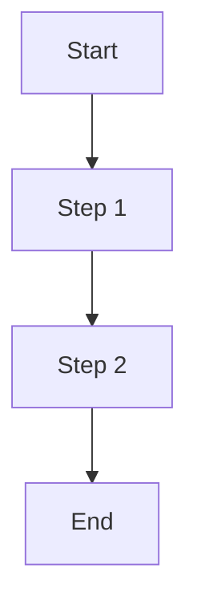

# Documentation Maintenance

## Overview

This guide defines how to maintain the Exonyms API documentation to keep it accurate, useful, and synchronized with the codebase.

## Documentation Structure

```
docs/
├── INDEX.md                          # Main documentation index
├── architecture.md                   # High-level architecture
├── repository-overview.md            # Repository overview
├── repository-structure.md           # Directory/file structure
├── design-decisions.md               # Design rationale
├── dependencies.md                   # External dependencies
├── configuration.md                  # Configuration reference
├── data-model.md                     # Domain models
├── state-and-persistence.md          # State management
├── components/
│   ├── presentation.md               # Controllers, middleware
│   ├── host-and-composition.md       # Startup, DI, middleware
│   ├── application-services.md       # Business logic services
│   └── integration-models.md         # External API models
├── flows/
│   ├── startup-and-rendering.md      # Application startup
│   └── exonym-gathering.md           # Core processing flow
├── behaviour/
│   └── browse-and-search.md          # User-facing behaviour
├── api-reference/
│   ├── INDEX.md                      # API reference index
│   └── exonyms-controller.md         # Endpoint documentation
├── integrations.md                   # External integrations
├── testing.md                        # Testing strategy
├── concurrency-and-scheduling.md     # Concurrency model
├── error-handling.md                 # Error handling patterns
├── logging.md                        # Logging framework
├── invariants.md                     # System invariants
├── build-and-deployment.md           # CI/CD and deployment
├── security.md                       # Security considerations
├── ambiguities-and-open-questions.md # Known issues
├── change-guide.md                   # Change procedures
└── documentation-maintenance.md      # This file
```

## Maintenance Principles

### 1. Documentation as Code

- Documentation lives in the repository
- Versioned with code
- Reviewed in pull requests
- Updated in the same commit as code changes

### 2. Single Source of Truth

- Code is the ultimate source of truth
- Documentation reflects code, not vice versa
- Automated checks where possible

### 3. Audience Awareness

| Audience | Documentation Focus |
|----------|---------------------|
| New developers | Architecture, repository structure, setup |
| API consumers | API reference, behaviour, integrations |
| Maintainers | Flows, components, invariants, change guide |
| Operators | Build/deployment, logging, monitoring, security |

## When to Update Documentation

### Mandatory Updates

| Trigger | Documentation to Update |
|---------|------------------------|
| New endpoint | `api-reference/`, `behaviour/` |
| New configuration | `configuration.md` |
| New external API | `integrations.md`, `components/integration-models.md` |
| Logic change | `flows/`, `components/application-services.md` |
| Breaking change | `change-guide.md`, `api-reference/` |
| New dependency | `dependencies.md` |
| Security change | `security.md` |
| New invariant | `invariants.md` |

### Recommended Updates

| Trigger | Documentation to Update |
|---------|------------------------|
| Bug fix | Related component/flow docs |
| Refactoring | `components/`, `architecture.md` |
| Performance improvement | `concurrency-and-scheduling.md` |
| New test pattern | `testing.md` |

## Documentation Standards

### Writing Style

- **Concise**: Prefer short sentences and bullet points
- **Technical**: Use precise terminology
- **Actionable**: Include examples and procedures
- **Current**: Reflect actual code state

### Formatting

- **Headers**: Use ATX style (`#`, `##`, `###`)
- **Code blocks**: Specify language (`csharp`, `json`, `bash`, `yaml`)
- **Tables**: Use Markdown tables for structured data
- **Links**: Use relative paths for repo files

### Code Examples

- **Real**: Copy from actual codebase
- **Complete**: Include necessary context
- **Tested**: Verify examples work
- **Annotated**: Explain key parts

### Diagrams

- **Mermaid**: Use for flowcharts and sequences
- **ASCII**: Use for simple structures
- **Source**: Keep diagram source in documentation

## Review Process

### Pull Request Checklist

- [ ] Documentation updated for all changes
- [ ] No stale/incorrect information
- [ ] Code examples compile/run
- [ ] Links work (relative paths)
- [ ] Spelling/grammar checked
- [ ] Consistent formatting

### Review Focus Areas

1. **Accuracy**: Does documentation match code?
2. **Completeness**: Are all aspects covered?
3. **Clarity**: Is it understandable by target audience?
4. **Consistency**: Does it follow style guide?

## Automation

### Link Checking

```bash
# Check for broken links
markdown-link-check docs/**/*.md
```

### Spell Checking

```bash
# Check spelling
cspell docs/**/*.md
```

### Code Example Validation

```bash
# Extract and compile code examples (future)
# dotnet build docs/examples/
```

### CI Integration

Add to `.github/workflows/dotnet.yml`:

```yaml
- name: Check documentation
  run: |
    markdown-link-check docs/**/*.md
    cspell docs/**/*.md
```

## Documentation Debt

### Tracking

Maintain a list of known documentation issues:

| File | Issue | Priority | Owner |
|------|-------|----------|-------|
| `architecture.md` | Missing deployment diagram | Medium | - |
| `api-reference/` | No OpenAPI spec | High | - |
| `testing.md` | Missing integration test docs | Medium | - |

### Reduction Strategy

1. **Prioritize** by impact and effort
2. **Assign** owners for each item
3. **Schedule** in sprints
4. **Verify** completion

## Versioning

### Documentation Versioning

- Documentation version matches code version
- Tagged with releases
- No separate versioning scheme

### Breaking Documentation Changes

- Update in same PR as code breaking change
- Note in release notes
- Communicate to consumers

## Tools

### Recommended Tools

| Tool | Purpose |
|------|---------|
| VS Code + Markdown extensions | Editing |
| markdown-link-check | Link validation |
| cspell | Spell checking |
| Mermaid | Diagrams |
| PlantUML | Complex diagrams (if needed) |

### VS Code Extensions

```json
{
  "recommendations": [
    "yzhang.markdown-all-in-one",
    "davidanson.vscode-markdownlint",
    "streetsidesoftware.code-spell-checker",
    "bierner.markdown-mermaid"
  ]
}
```

## Templates

### New Component Documentation

```markdown
# Component Name

## Overview
Brief description of the component's purpose.

## Responsibilities
- Responsibility 1
- Responsibility 2

## Dependencies
- Dependency 1
- Dependency 2

## Interface
```csharp
public interface IComponentName
{
    Task<Result> MethodName(Input input);
}
```

## Implementation
Key implementation details.

## Configuration
Settings used by this component.

## Testing
How to test this component.

## Related Documentation
- [Link to related doc](../path/to/doc.md)
```

### New Flow Documentation

```markdown
# Flow Name

## Overview
Brief description of the flow.

## Trigger
What initiates this flow.

## Steps
1. Step 1
2. Step 2
3. Step 3

## Diagram


## Error Handling
How errors are handled in this flow.

## Performance
Latency, throughput, bottlenecks.

## Related Documentation
- [Link to related doc](../path/to/doc.md)
```

## Archival

### When to Archive

- Documentation for removed features
- Superseded design documents
- Old decision records

### Archive Process

1. Move to `docs/archive/`
2. Add `ARCHIVED:` prefix to title
3. Add note with date and reason
4. Update links in active documentation

## Metrics

### Documentation Health

| Metric | Target | Measurement |
|--------|--------|-------------|
| Coverage | 100% of public APIs | Manual review |
| Freshness | < 30 days stale | Git history |
| Accuracy | 0 known errors | Issue tracker |
| Link validity | 0 broken links | CI check |

### Reporting

- Monthly documentation health report
- Track in project dashboard
- Address in retrospectives

## Onboarding

### New Contributor Guide

1. Read `architecture.md` and `repository-overview.md`
2. Review `change-guide.md`
3. Run local build and tests
4. Make a small documentation improvement
5. Submit PR for review

### Documentation Tour

| Document | Time | Purpose |
|----------|------|---------|
| `architecture.md` | 10 min | System overview |
| `repository-structure.md` | 5 min | Code organization |
| `flows/exonym-gathering.md` | 15 min | Core logic |
| `api-reference/exonyms-controller.md` | 10 min | API contract |
| `change-guide.md` | 10 min | Contribution process |

## Related Documentation

- [Change Guide](../change-guide.md)
- [Architecture](../architecture.md)
- [Repository Structure](../repository-structure.md)
- [Testing](../testing.md)